# Jàng — le correcteur de Bac qui montre ta première erreur

> **GET 409 — Atelier IA** · Swiss UMEF University, Campus de Dakar · 2025–2026
> Équipe : **Cheikh BOYE** · **Adama DIOP** · Enseignant : M. Malick Faye Diagne

> 📦 **Rendu GET 409 du 6 octobre** : page d'accueil du projet, vidéo et liens vers tous les livrables → [dépôt `jang`](https://github.com/cboye4991-sketch/jang#-rendu-du-6-octobre--par-où-commencer)

**▶ Application en ligne : [cboye4991-sketch.github.io/jang-bac-helper](https://cboye4991-sketch.github.io/jang-bac-helper/)**

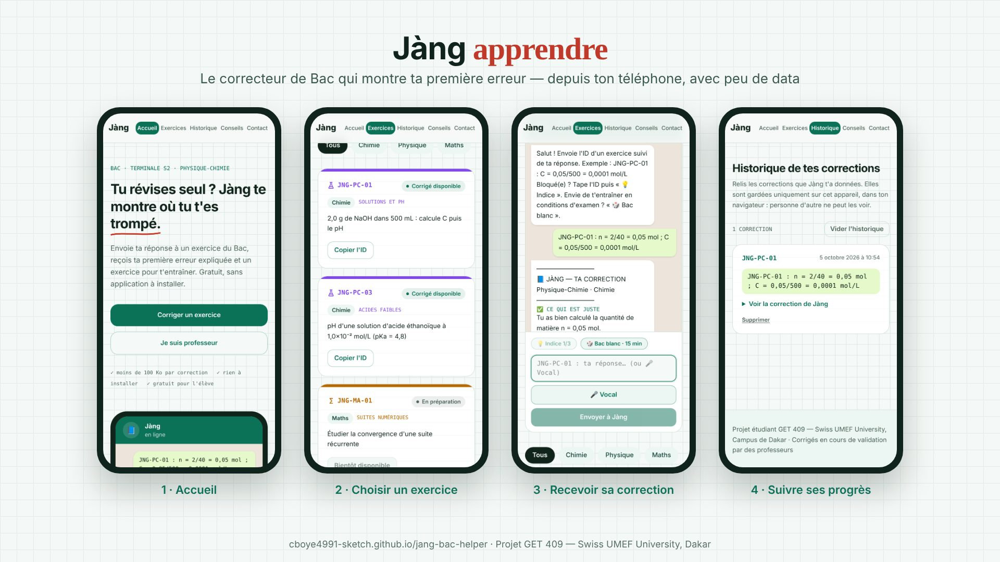

*Jàng* veut dire « apprendre » en wolof. L'application s'adresse aux élèves de **Terminale S des lycées de région**
qui révisent seuls, faute de professeur. L'élève envoie sa réponse à un exercice type Bac. Jàng **compare sa réponse à
un corrigé de référence** (RAG) et lui montre **sa première erreur**, la méthode, puis un exercice similaire pour vérifier
qu'il a compris. Tout cela depuis le téléphone qu'il a déjà, pour **moins de 100 Ko par correction**.

Dossier Design Thinking complet (persona, HMW, VPC, journal de prompts, Dify) : dépôt [`jang`](https://github.com/cboye4991-sketch/jang).

---

## Ce que fait l'application

| Fonctionnalité | Ce que voit l'élève |
|---|---|
| **Correction en 4 blocs** | ✅ ce qui est juste · ❌ la première erreur · 💡 la méthode · ➡️ un exercice à faire |
| **✍️ Vérifie mon similaire** | Après la correction, l'élève envoie sa réponse à l'exercice similaire et Jàng vérifie s'il a compris |
| **💡 Indices progressifs** | 3 coups de pouce gradués (la loi → la formule → la 1re étape), jamais le résultat |
| **🎲 Bac blanc · 15 min** | Un exercice tiré au sort, avec chronomètre et sans indice |
| **🎤 Note vocale** | L'élève dicte sa réponse (« 0 virgule 05 sur 500 » → `0,05/500`), la relit, puis l'envoie |
| **🔊 Écouter** | La correction lue à voix haute par la voix du téléphone (0 donnée consommée) |
| **📲 Défier un camarade** | Un lien WhatsApp prérempli qui ouvre Jàng sur le même exercice |
| **Historique** | Les corrections sont gardées sur le téléphone uniquement, sans compte |

## Captures d'écran

La correction ci-dessous est **une vraie réponse du workflow Dify** (exercice JNG-PC-01, réponse avec l'erreur classique
« 500 mL au lieu de 0,500 L »), obtenue sur le site en ligne le 05/10/2026.

| Accueil | Correction par l'agent IA |
|---|---|
| 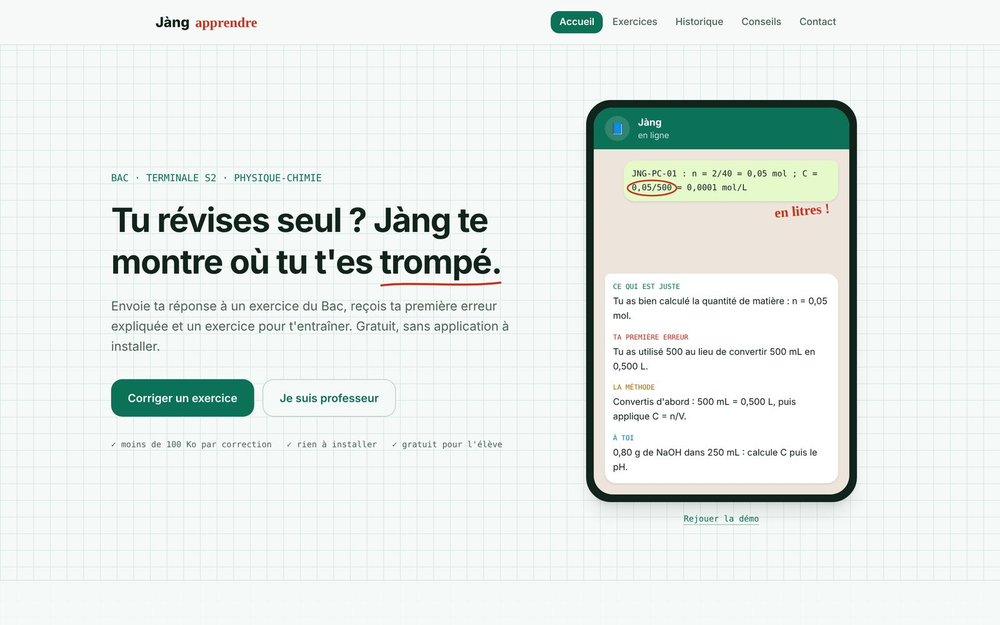 | 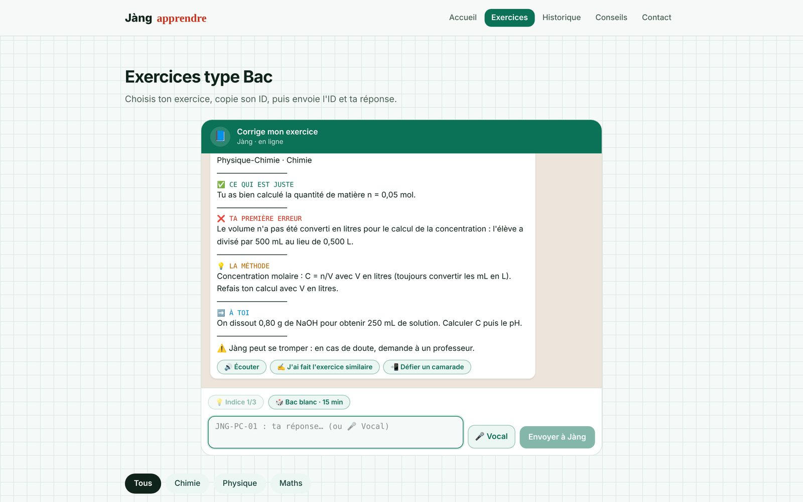 |

| Exercices type Bac | Historique |
|---|---|
| 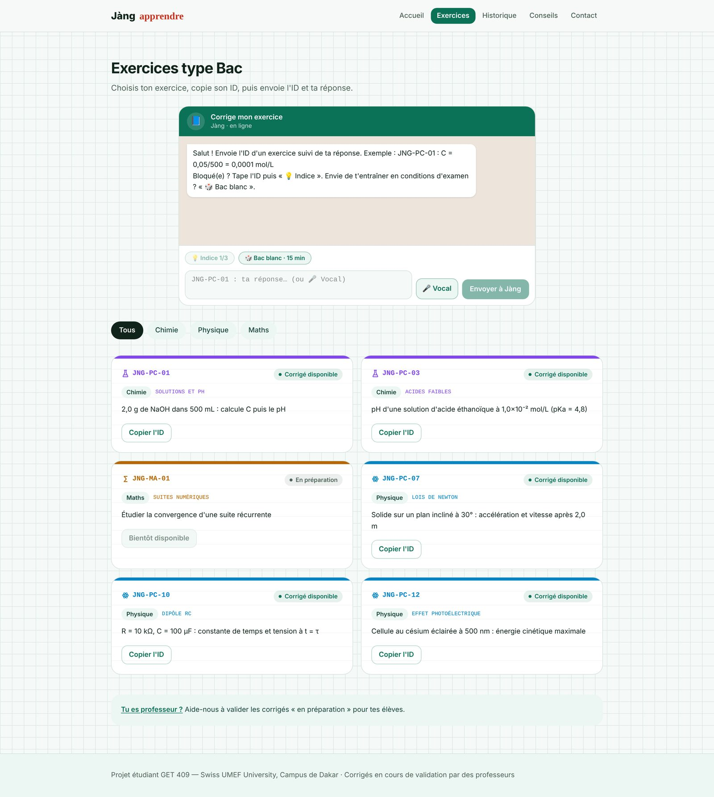 | 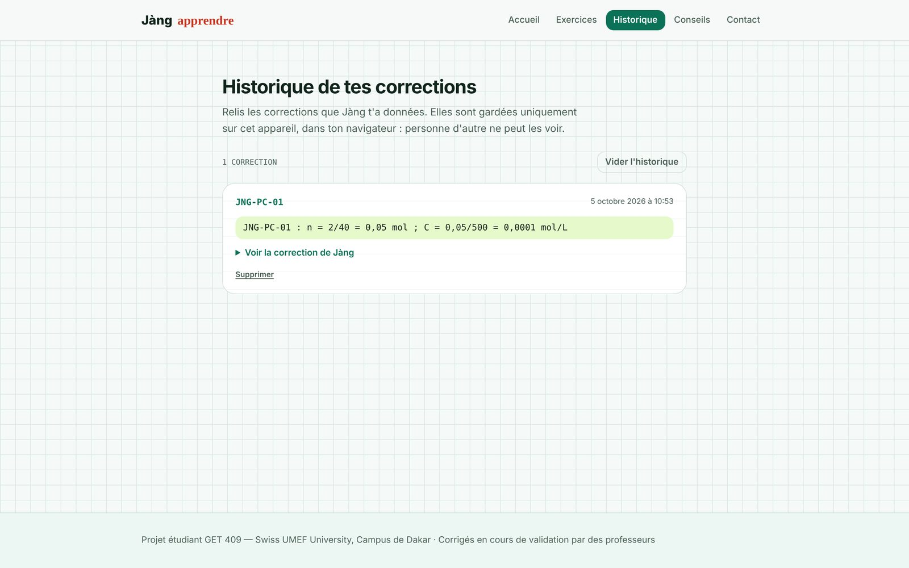 |

| Conseils de révision | Contact professeurs |
|---|---|
| 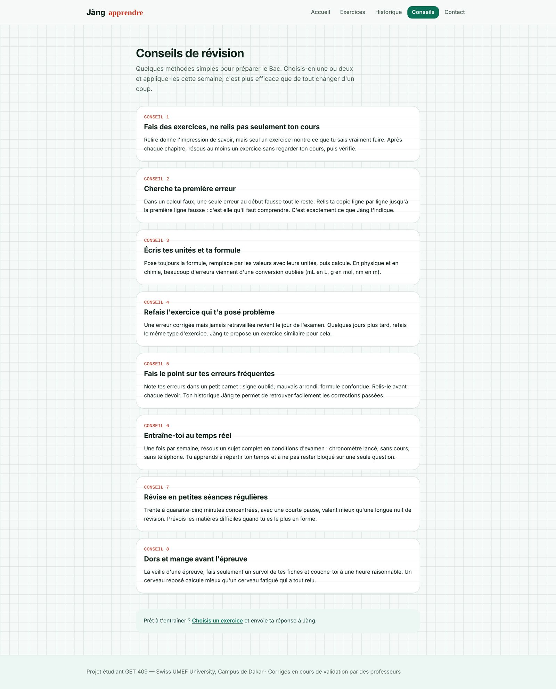 | 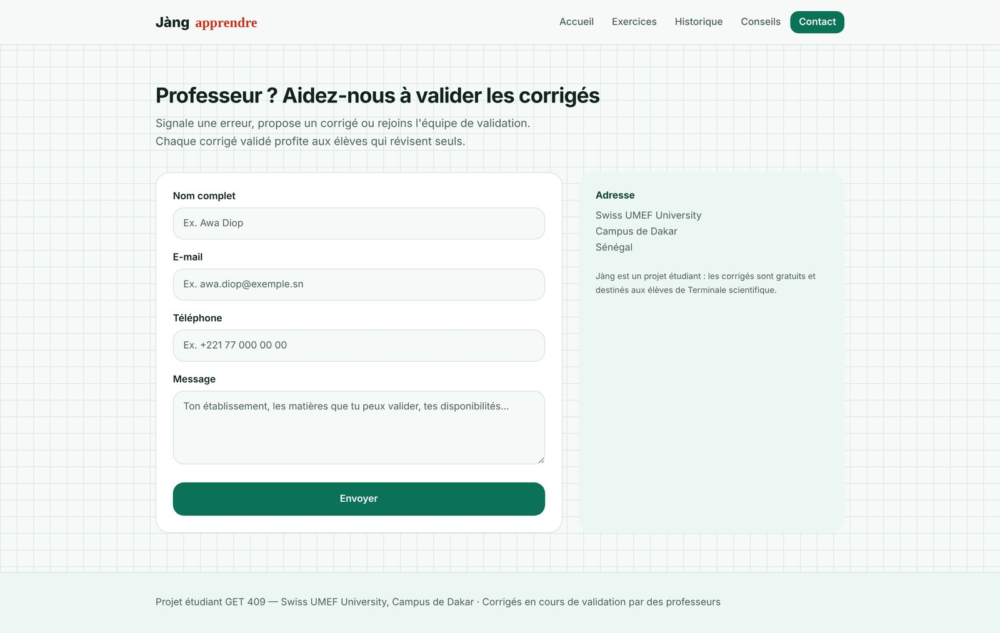 |

**Sur téléphone (360–390 px, le format des Android d'entrée de gamme) :**

| Accueil | Exercices | Correction | Historique |
|---|---|---|---|
| 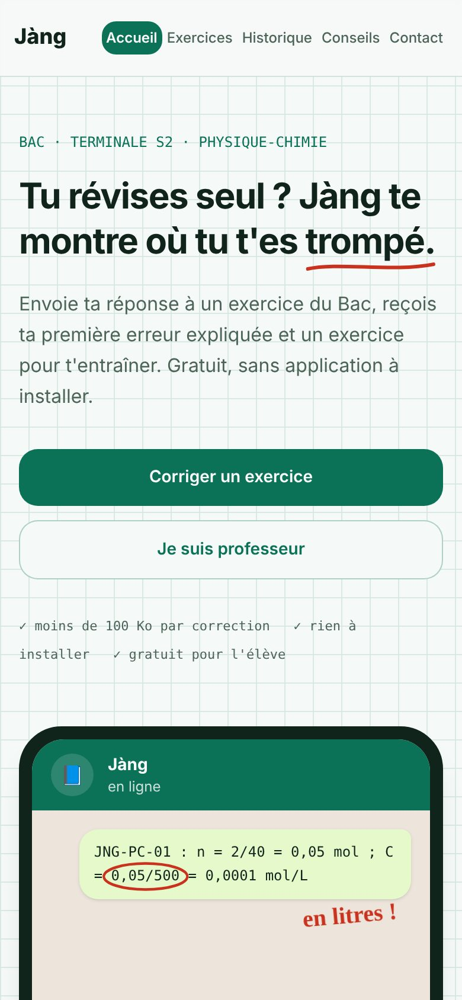 | 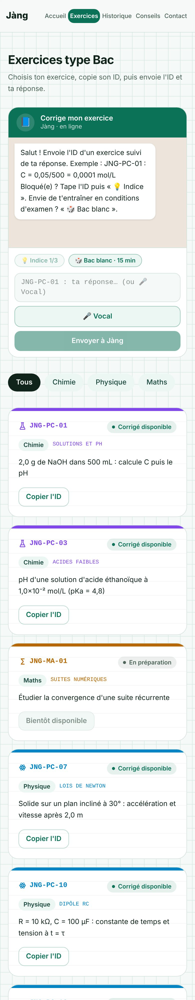 | 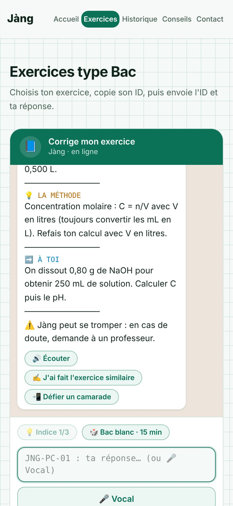 | 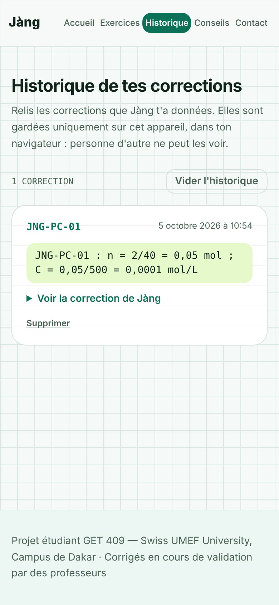 |

## Architecture

```
Élève (téléphone)
   │  ID de l'exercice + réponse
   ▼
Site statique — GitHub Pages (ce dépôt)
   │  POST { query }            ← aucune clé dans le navigateur
   ▼
Fonction Supabase « corriger »  ← garde la clé Dify (secret serveur)
   ▼
Workflow Dify « jang »
   EXTRAIRE_ID → RÉCUPÉRATION (base Jang_KB_v1 : 14 exercices + corrigés de référence, 14 fiches)
   → CHERCHEUR (compare au corrigé) → SI/SINON (hors sujet ?) → RÉDACTEUR (correction ≤ 90 mots)
```

Schéma détaillé : [`architecture-v2.png`](https://github.com/cboye4991-sketch/jang/blob/main/docs/architecture-v2.png) · Note d'éthique : [`note-ethique-rag.md`](https://github.com/cboye4991-sketch/jang/blob/main/docs/note-ethique-rag.md)

**Pourquoi un relais ?** Tout ce qui est envoyé au navigateur est lisible par n'importe qui. La clé Dify reste donc dans
une fonction serveur et le site ne la voit jamais. Hébergement sur GitHub Pages (Vercel et Netlify n'étant pas autorisés
pour ce projet). Guide de mise en ligne pas à pas : [`deploy/README.md`](deploy/README.md).

## Stack

React 19 · TanStack Start/Router · Tailwind CSS · Vite · TypeScript — prototype généré avec Lovable (S4), puis repris et
modifié dans VS Code et Claude Code. Prompt Lovable de départ : [`docs/prompt-lovable-initial.md`](docs/prompt-lovable-initial.md).

```bash
npm install
npm run dev                         # local, correction via .env.local (DIFY_API_KEY, jamais commitée)
GITHUB_PAGES=1 npm run build        # build statique publié par .github/workflows/pages.yml
```

## Limites, dites honnêtement

- Les 14 exercices et leurs corrigés sont **rédigés par l'équipe** sur le modèle du Bac. Ils sont en cours de validation
  par des professeurs, et l'application le rappelle sous chaque correction.
- Jàng peut se tromper : chaque réponse invite à vérifier avec un professeur en cas de doute.
- Le canal WhatsApp réel (bot) est prévu pour une phase 2 ; le site imite déjà l'échange WhatsApp.
- Aminata, notre persona, est fictive ; aucune donnée d'élève n'est collectée (historique local uniquement).
